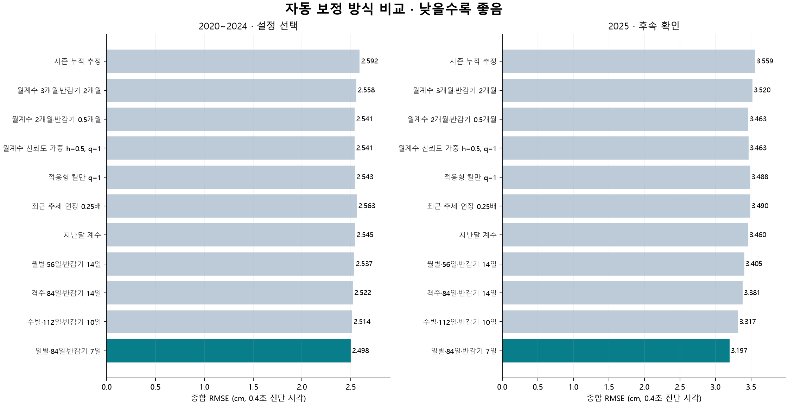
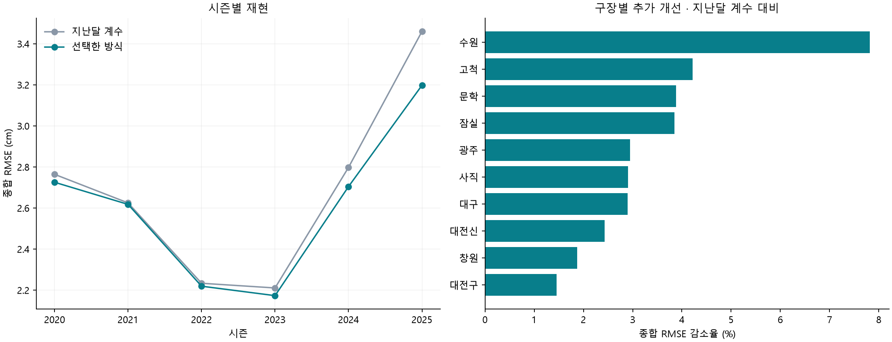

# 자동 구장 편향 보정: 86개 설정의 시간순 비교

2026-09-20 · 현재 봉인된 2020~2025 경기 스냅샷을 사용한 후향적 연구

## 이번에 고른 방식

**매일 최근 84일 자료로 다시 추정하고, 자료가 7일 오래될 때마다 가중치를 절반으로 줄이는 방식**을 기본 후보로 권한다.
설정 ID는 `daily_w84_h7`다. 월별 계수끼리 평균내는 단계보다, 최근 경기 자료에 직접 시간 가중치를 주어 구장 효과를 다시 적합하는 단계에서 개선이 컸다.

같은 41,477개 투수·경기·구종 셀에서 지난달 계수 대비 종합 RMSE가 **2.763 → 2.661cm, 3.69% 감소**했다.
2025년만 보면 **3.460 → 3.197cm, 7.58% 감소**했다.
보정 없음 대비 개선은 X 55.3%, Z 39.2%다. 큰 효과는 구장 보정 자체에서 나오며, 자동 갱신 방식의 개선은 그 위에 더해지는 효과다.

여기서 “최선”은 이번 후보·표본·평가 기준에서의 최선이다. 인접한 반감기·기간 설정의 작은 차이까지 확정적인 우열로 해석하지 않는다.
특히 같은 일별·7일 반감기에서 최근 56일과 84일의 전체 종합 RMSE는 각각 2.66155, 2.66138cm로 사실상 같다.
84일은 탐색 규칙에 따라 선택한 기본값이며, 56일보다 실질적으로 우월하다는 의미는 아니다.
2025년만 보고 반감기를 3.5일로 바꾸지는 않았다. 7일은 2020~2024년으로 고른 설정이다.
선택 방식은 주별 최상위 후보보다 2025 종합 오차가 3.61% 작았다. 이 차이의 참고 95% 구간은 1.89~4.96%다.

## 실제로 비교한 방법

1차로 63개 보정 설정을 비교한 뒤, 선택기간에서 84일 창·14일 반감기·주별 갱신이 좋아 탐색 경계를 넓혔다.
일별·격주 갱신, 3.5·7·10·21일 반감기, 112일 창 등을 추가해 **보정 후보 86개와 무보정 대조군 1개**를 같은 표본에서 비교했다.

- 지난달 계수, 시즌 누적 추정.
- 최근 2·3·6개월 계수의 지수 가중평균, 재귀 평활화.
- 월별 계수의 추정 분산을 사용하는 신뢰도 가중.
- 구장 간·X/Z 공분산을 반영한 칼만 필터, 관측 급변에 반응하는 적응형 칼만 필터.
- 최근 월별 추세를 약하게 연장하는 방식.
- 최근 28·56·84·112일 자료의 직접 재추정, 월별·격주·주별·일별 갱신.
- 큰 잔차의 영향을 줄이는 Huber 재추정.

각 계열의 대표 설정은 2020~2024년 성능으로 골랐다. 아래 cm는 모두 **0.4초 공통 진단 시각** 기준이다.

| 방식 | 전체 X | 전체 Z | 전체 종합 | 2025 종합 |
| --- | --- | --- | --- | --- |
| 보정 없음 | 6.078 | 4.287 | 5.259 | 6.230 |
| 시즌 누적 추정 | 2.914 | 2.731 | 2.824 | 3.559 |
| 월계수 3개월·반감기 2개월 | 2.868 | 2.707 | 2.789 | 3.520 |
| 월계수 2개월·반감기 0.5개월 | 2.830 | 2.691 | 2.761 | 3.463 |
| 월계수 신뢰도 가중 h=0.5, q=1 | 2.831 | 2.690 | 2.761 | 3.463 |
| 적응형 칼만 q=1 | 2.843 | 2.694 | 2.770 | 3.488 |
| 최근 추세 연장 0.25배 | 2.861 | 2.705 | 2.784 | 3.490 |
| 지난달 계수 | 2.834 | 2.691 | 2.763 | 3.460 |
| 월별·56일·반감기 14일 | 2.810 | 2.675 | 2.743 | 3.405 |
| 격주·84일·반감기 14일 | 2.783 | 2.668 | 2.726 | 3.381 |
| 주별·112일·반감기 10일 | 2.757 | 2.649 | 2.704 | 3.317 |
| 일별·84일·반감기 7일 | 2.715 | 2.607 | 2.661 | 3.197 |

월별 평활화와 칼만 필터는 단순 지난달 계수를 안정적으로 능가하지 못했다. 월이 끝날 때까지 기다리는 지연을 줄이는 쪽이 이번 자료에서는 더 효과적이었다.
이는 비교 결과에 대한 해석이며, 구장 장비가 실제로 그 주기로 변한다는 직접 증거는 아니다.

## 어떤 검증인가

**계수를 만들 때 평가 경기보다 나중에 열린 경기의 기록은 사용하지 않았다.**
월별 방식은 월초 이전, 주별 방식은 월요일 이전, 일별 방식은 당일 이전 자료만 사용했다.
모든 갱신은 해당 시즌 자료만 쓰고, 이전 시즌 계수는 승계하지 않았다.
미래 관측을 훈련에서 제외하는 [시간순 교차검증 원칙](https://otexts.com/fpp3/tscv.html)을 적용했다.

**설정 선택은 2020~2024년 32,713개 셀, 후속 확인은 2025년 8,764개 셀로 분리했다.**
다만 2025년은 앞선 분석에서 이미 집계 성능을 살펴본 자료이며 이번에도 탐색적 후속 확인이다.
완전히 미개봉한 최종 시험이나 2026년 전향적 검증으로 표현하지 않는다.
또한 현재 sealed revision을 사용했으므로 경기 당시의 수집·정정 완료 시점까지 재현한 운영 백테스트는 아니다.

단위 셀은 같은 투수·경기·구종의 5구 이상 평균이다. 회귀에는 투수×구종×달 고정효과, 구종별 구속의 1·2차 항,
타석 방향과 볼·스트라이크 카운트를 넣었다. 구장 효과를 추정할 때 기본 셀 가중치는 `min(투구 수,30)`이다.
평가에서는 모든 방법에 동일한 과거 구속·타석·카운트 보정을 적용한 뒤, 해당 평가 월의 투수·구종 평균을 제거했다.
이 마지막 평균 제거는 점수 계산만을 위한 것으로, 보정계수 생성에는 쓰이지 않는다.

따라서 평가 대상은 **동일 투수·구종의 경기장 간 일관성**이다. 다음 투구의 절대 구위 예측 정확도나 센서 오차의 정답과 일치하는 정도가 아니다.
종합 RMSE는 `sqrt((X 잔차제곱합 + Z 잔차제곱합)/(2×셀 수))`이며 셀과 두 축을 같은 비중으로 평가한다.

모든 방법은 동일한 24개 시즌·월, 41,477개 셀에서 비교했다. 구장당 최소 5경기·20투수와 비교 연결성을 요구했다.
짧은 기간 방식이 이 조건을 못 채운 구장은 당시 이용 가능한 최근 월별 추정치, 이어서 시즌 누적치로 대체했다.
선택 방식의 평가 셀 대체 비율은 **0.00%**였다. 평가 범위는 시즌 중 5~9월의 지원 가능한 월이며, 개막 초기·비시즌·희소 구장은 별도 검증이 필요하다.

## 특정 해나 구장만 좋아졌는가

| 시즌 | 지난달 계수 | 선택 방식 | 추가 개선 |
| --- | --- | --- | --- |
| 2020 | 2.764 | 2.725 | 1.40% |
| 2021 | 2.624 | 2.617 | 0.27% |
| 2022 | 2.233 | 2.219 | 0.64% |
| 2023 | 2.210 | 2.173 | 1.69% |
| 2024 | 2.797 | 2.704 | 3.34% |
| 2025 | 3.460 | 3.197 | 7.58% |

구장 단위로는 10/10곳에서 개선됐다. 모든 평가 구장에서 개선됐다.

모형을 고르는 행위까지 시간순으로 반복했다. 2023년은 2020~2022년, 2024년은 2020~2023년,
2025년은 2020~2024년 결과만으로 설정을 선택한 뒤 다음 해 성능을 확인했다.

| 평가 시즌 | 앞선 시즌들로 선택한 설정 | 그해 추가 개선 |
| --- | --- | --- |
| 2023 | 일별·84일·반감기 14일 | 1.84% |
| 2024 | 일별·84일·반감기 14일 | 2.77% |
| 2025 | 일별·84일·반감기 7일 | 7.58% |

## 차이가 얼마나 확실한가

선택 방식은 지난달 계수보다 **23/24개 평가 월**에서 종합 제곱오차가 작았다.
시즌과 시즌 내 연속 평가 월 2개 묶음을 함께 재표집한 10,000회 대응 부트스트랩에서 추가 개선율의 참고 95% 구간은
**0.83~6.72%**였다.
2025년만의 참고 구간은 **2.41~11.74%**였다.
일부 평가 월 사이에는 공백이 있어 묶음이 항상 연속된 달력 월은 아니다.
연도가 6개, 2025년 평가 월이 5개뿐이고 여러 설정을 탐색했으므로, 이 구간은 확정적 유의성 판정으로 쓰지 않는다.

평가 방법을 바꿔도 방향을 확인했다.

- 같은 투수·구종을 한 달 대신 약 14일 안에서 비교: 30,582개 셀, 추가 개선 4.42%.
- 평가 시 투수·구종 평균을 투구 수 가중 대신 셀 동일 가중으로 계산: 추가 개선 3.71%.
- 평가 경기를 동일 비중으로 집계: 추가 개선 3.73%.

선택기간의 상위 설정은 다음과 같다. 소수점 아래 작은 순위 차이보다 최근 자료를 빠르게 반영한다는 공통점을 중시한다.

| 선택기간 순위 | 설정 | 2020~2024 종합 | 2025 종합 |
| --- | --- | --- | --- |
| 1 | 일별·84일·반감기 7일 | 2.49835 | 3.19731 |
| 2 | 일별·56일·반감기 7일 | 2.49859 | 3.19726 |
| 3 | 일별·56일·반감기 14일 | 2.50071 | 3.26140 |
| 4 | 일별·84일·반감기 14일 | 2.50089 | 3.26203 |
| 5 | 일별·56일·반감기 28일 | 2.50757 | 3.31509 |
| 6 | 일별·84일·반감기 28일 | 2.51174 | 3.32305 |
| 7 | 일별·84일·반감기 3.5일 | 2.51265 | 3.16691 |
| 8 | 주별·112일·반감기 10일 | 2.51397 | 3.31716 |
| 9 | 주별·84일·반감기 10일 | 2.51398 | 3.31791 |
| 10 | 주별·56일·반감기 10일 | 2.51472 | 3.32030 |

## 자동 계산에 사용할 구체적인 규칙

1. **평가면:** 모든 시즌을 중간면 `y=17/24 ft`에 맞춘다. 원천 `cross_plate_y`는 보존한다.
2. **자료 창:** 계산 시점 이전의 해당 시즌 최근 84일을 읽는다. 매일 새 계수를 계산한다.
3. **가중치:** `min(셀 투구 수,30) × 2^(-경과일/7)`를 회귀에 직접 준다. 원시 구장 평균에 적용하지 않는다.
4. **비교 조건:** 동일 투수·구종·달과 구속·타석 방향·카운트를 통제한다. 최소 5경기·20투수, 다른 구장과 연결된 표본을 확인한다.
5. **기준점:** 잠실 대비 차이를 추정하고, 동일한 구장 집합의 고정 가중치로 중심화한다. 잠실의 실제 오차가 0이라는 가정은 하지 않는다.
6. **저장:** 계수는 `kx/kz` 가속도 단위(ft/s²)로 저장한다. 보고서의 cm 값을 가속도로 바꾸는 나눗수는 `2.4384`다.
7. **적용:** `kx_corrected=kx_raw-bx`, `kz_corrected=kz_raw-bz`. 화면에서는 사용하는 궤적 시각 T에 따라 `0.5×T²×30.48`을 곱한다.
8. **이력:** 계산 시점, 유효 시작 시점, 자료 범위·해시, 표본 수, 불확실성, 모델 버전을 남긴다. 월말 스냅샷도 보관할 수 있다.

자료가 7일 더 오래될 때 회귀 가중치가 절반이 된다는 뜻이다. 경기 수와 투구 수가 다르므로 달별 실제 비중이 항상 고정되지는 않는다.
지수 감쇠의 기본 개념은 [NIST 설명](https://www.itl.nist.gov/div898/handbook/pmc/section4/pmc43.htm)과 같다.
칼만 후보는 [Welch·Bishop의 재귀 추정식](https://homepages.inf.ed.ac.uk/rbf/CVonline/LOCAL_COPIES/WELCH/kalman.html)을 바탕으로,
월별 측정 공분산과 무작위 변화 분산을 분리했다. 월별 공분산은 투수·경기 2방향 군집 샌드위치로 계산하고,
수치적으로 음수가 될 수 있는 고유값에 0.04cm² 바닥값을 적용했다.

신규 구장은 별도 ID로 시작한다. 대전 구장과 2025년 신구장은 합치지 않았다. 표본 부족 시 근거 없는 신규 계수를 확정하지 않으며,
실시간 운영에서는 추정 상태와 자료 나이를 함께 제공하는 것이 적절하다. 개막 초기·장기 결측·비시즌 승계 정책은 이번 선택의 검증 범위 밖이다.

이 분석은 궤적의 초기 진행 방향에 대해 정렬한 가속도 기반 무브먼트다. 중력 제거 IVB라고 해석하지 않는다.
구장 효과에는 관측 장비뿐 아니라 날씨·환경이나 충분히 통제되지 않은 실제 변화도 섞일 수 있다.
절대적인 장비 오차를 분리하려면 별도 기준 장비나 실험 자료가 필요하다.

## 재현과 계산 확인

원본 4,693경기·1,428,758개 실제 투구의 읽기 전용 추출에서 중간면 기준 셀을 다시 구성했다.
분석용 파일만 추가했으며, 원천 데이터·DB fact·서비스 보정 로직은 변경하지 않았다.

- 기존 5개 방식의 제곱오차 재현 최대 차이: `8.51e-10`.
- 알려진 편향을 넣은 합성 자료의 계수 복원 최대 오차: `3.20e-14`.
- 순서 변경·공통 상수 이동에 대한 계수 불변성, 동일 평가 표본, 훈련일 < 적용일, 경기별/월별 합산 일치를 확인했다.
- 저장된 계수만 읽는 별도 재생 경로로 선택 방식의 점수도 재현했다.

실행 순서는 `calibration_search.py --extended`, `evaluate_calibration_search.py`, `calibration_search_diagnostics.py`, `render_calibration_search.py`다.
원천 gzip 경로는 기존 [snapshot.json](snapshot.json)에 있다.

[전체 설정](calibration-search/protocol.json) · [86개 설정 전체 점수](calibration-search/leaderboard.csv) ·
[최종 선택](calibration-search/selection.json) · [월별 점수](calibration-search/scores.csv) ·
[훈련 시점 감사](calibration-search/training-audit.csv) · [수치 검증](calibration-search/verification.json) ·
[연도별 순차 선택](calibration-search/nested-year-validation.csv) · [불확실성](calibration-search/uncertainty.csv)
